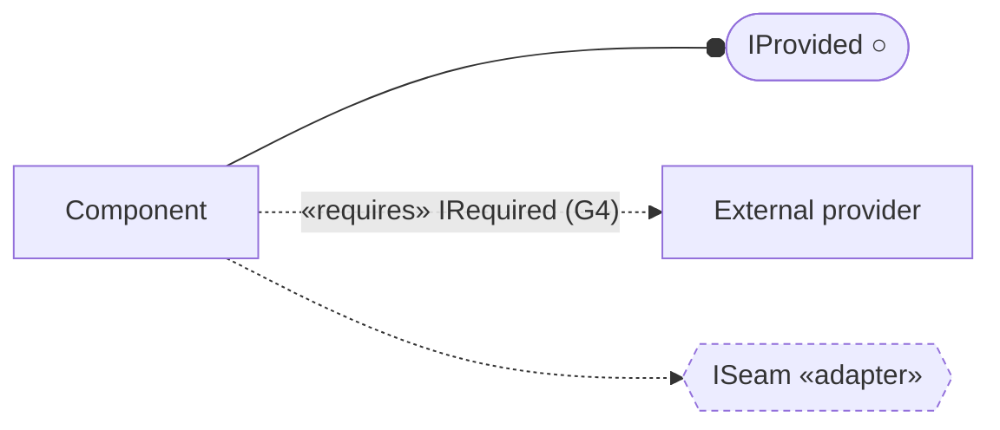

# rmf_oblysk (overlay) — Detailed Design

Component-altitude design for the `control.dispatch` seam. Overlay boundary:
[`../../ARCHITECTURE.md`](../../ARCHITECTURE.md). Group-altitude design and the G4 component table:
the superproject's `design/pages/04-control-rmf-core.md` and
`design/pages/00-component-catalog.md`.

**Everything in this tree is oblysk-authored and sits under `oblysk/` deliberately.** The repository
root is a mirror of `open-rmf/rmf`; its `docs/` directory holds upstream files that
`git merge upstream/main` runs against. Placing a design tree there would put authored content on the
merge surface. See [`../../ARCHITECTURE.md §0`](../../ARCHITECTURE.md#0-why-this-page-is-under-oblysk).

## 0. Interface-diagram convention

Every component page opens with an **Interfaces** section (§2) that draws its **provided** interfaces
(what it exposes), its **required** interfaces (what it consumes from named external providers), and
any **seam** interfaces (a designed interface over a deferred or complex subcomponent — an adapter or
a strategy). Mermaid flowcharts have no native lollipop/socket, so this is the agreed approximation.

Restated here rather than linked: the same convention is in force in `edge_oblysk` at
`docs/design/fast-path/README.md §0` and again at `docs/design/ha/README.md §1`, in
`cognition_oblysk` at `docs/design/README.md §0`, in `audit_oblysk` at `docs/design/README.md §0`,
and in `transport_oblysk` at `docs/design/README.md §0`. A per-group restatement is the convention
rather than a workaround — a relative link between two submodule trees would not resolve.

- **Provided** — a lollipop the component exposes — `Comp --o IProvided` (circle endpoint).
- **Required** — a socket onto an external provider — `Comp -.->|"«requires» …(owner)"| Provider`
  (dashed edge, labelled with the interface and its owning group/repo).
- **Seam** — a designed interface over a deferred/complex subcomponent — a hexagon
  `{{IName «adapter»}}` / `{{IName «strategy»}}` with a dashed border
  (`classDef seam stroke-dasharray:4 3`).
- **Internal uses** — composition *within* the process (a component driving one of its own units) —
  a plain solid arrow `Comp --> Unit`.

**Readability over completeness.** Diagrams are kept small and composed: no single diagram tries to
show every component with every interface; a dense §2 is split into separate *provided* and
*required/seam* diagrams. Duplicating a node across two small diagrams is preferred over one crowded
diagram.

## 1. Pages

| Page | Seam | Shape |
|---|---|---|
| [`control/dispatch.md`](control/dispatch.md) | `control.dispatch` | **reduced** — §1, §2, §6, §12, §12.1, §13 written; §3–5 and §7–11 pointer-stubbed |
| [`invariants/control.md`](invariants/control.md) | — | admitted `INV-RMF-*` catalog |
| [`verification/control.md`](verification/control.md) | — | harness, fault catalog, tiers, T0 obligation |

`control.deconflict` is owned by this repo and is **not** manifested. When it is, it joins
`invariants/control.md` rather than getting its own catalog — the graining is per repo, not per seam,
which is why the token is `RMF` and not `DISPATCH`.

## 2. Altitude

A fact lives at exactly one altitude.

The **`ValidatedTaskRequest` (`oblysk_envelope`) contract** is owned by the superproject
(`design/pages/00-component-catalog.md:87`, where the SEV emits it as the Dispatcher's only legal
input) and is **cited here, never restated**. A second copy would be the drift the altitude rules
forbid, and a costly one: it is the contract that joins G3 to G4, so a divergent copy in a build repo
would be indistinguishable from an amendment to the interface between two groups.

What this tree owns is everything below that contract: the obligations the dispatcher must meet when
handed one, the algorithms that establish them, and the capability ladder that says which are claimed
at which rung.

**The vendor line is an altitude question too, and it is the one specific to this repo.** `rmf_task`
is upstream code. This tree does not describe what it does; it describes what any implementation
behind this boundary must guarantee. The test is
[`invariants/control.md §6`](invariants/control.md#6-mechanism-swap-self-check): replace the bid/award
auction with a static assignment table and see which rows move. None do. A row that moved would be
describing upstream rather than constraining it, and would belong in the design page's §6 — or
nowhere.
