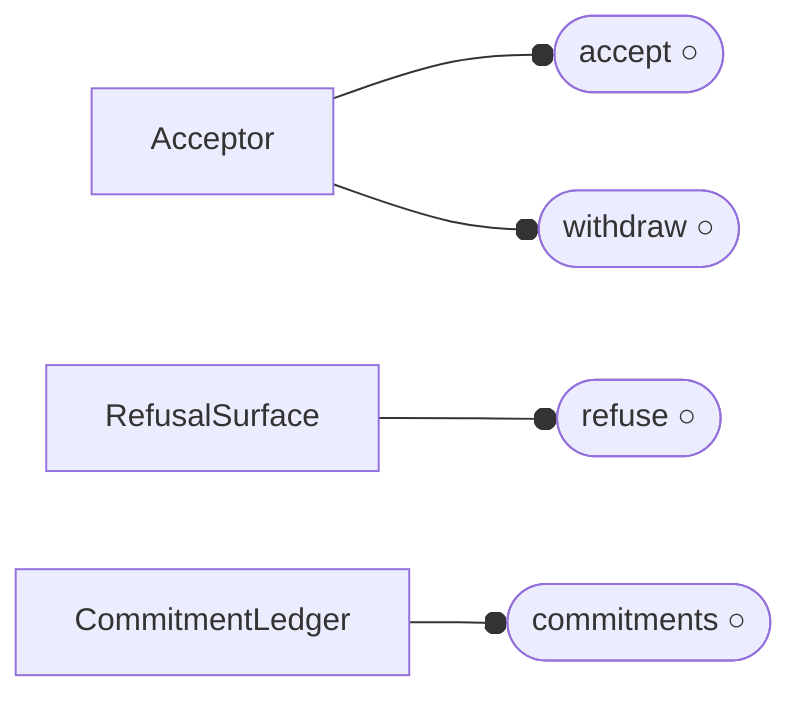
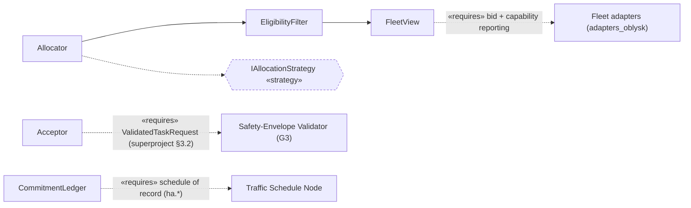

# `rmf_task` Dispatcher — Detailed Design

## 1. Overview & responsibilities

> **This is a reduced page.** Per the Stage 0 Cycle B manifest cycle (design record
> `docs/superpowers/specs/2026-09-20-stage-0-cycle-b-spine-seams-design.md` §5),
> this page carries **§1, §2, §6, §12 (incl. §12.1) and §13**. Sections **§3 Adapter interfaces, §4
> Models, §5 Static view, §7 Dynamic view, §8 State diagram, §9 Deferred components, §10 Error / edge
> handling and §11 Threading / real-time are deferred** to a later full-`§1–13` uplift and point at
> [`../../../ARCHITECTURE.md`](../../../ARCHITECTURE.md) and the superproject's
> `design/pages/04-control-rmf-core.md` meanwhile. The `§12.1` manifest is **complete and
> load-bearing**; the deferred sections do not gate it. Interface-diagram convention:
> [`../README.md §0`](../README.md#0-interface-diagram-convention).

**Ownership decision (pointing outward, twice).** This page owns neither of the two contracts that
bound it. The `ValidatedTaskRequest` (`oblysk_envelope`) envelope is ratified in the superproject at
`design/pages/00-component-catalog.md:87` — the SEV emits it and this component consumes it, and a
contract joining two groups cannot have its definition inside one of them. And the **dispatcher
itself is upstream code**: `rmf_task` is `open-rmf/rmf`'s, not oblysk's. This page does not describe
what upstream does; it fixes what any implementation behind this boundary must guarantee.

**Core property:** what this component controls is **commitment** — which robot is bound to which
task, and whether that binding can be honoured. Read as a *scheduler* it becomes a component about
throughput and fairness and carries no invariants at all, which is how dispatchers come to be
designed as queues. Every row below is a way a commitment can be made that the floor cannot honour,
or an accepted artifact can come to sit in neither of its two legitimate end states
([`../invariants/control.md §1`](../invariants/control.md#1-control-structure)).

**The test that keeps this page honest about the vendor line** is
[`../invariants/control.md §6`](../invariants/control.md#6-mechanism-swap-self-check): replace the
bid/award auction with a static assignment table and see which rows move. None do. A row that moved
under that swap would be describing `rmf_task` rather than constraining it, and would belong in §6
here — or nowhere.

Subcomponents:

- **`Acceptor`** — the boundary at which a validated request enters the accepted set, and the only
  place capacity is refused. Owns the entry half of every request's two-exit lifecycle.
- **`EligibilityFilter`** — decides, for a request and a bidder, whether the bidder may be awarded
  it. A total function of declared inputs; no cost, score or priority reaches it.
- **`Allocator`** — solicits bids and selects among the *eligible* set. The one subcomponent the
  mechanism swap replaces wholesale, and deliberately the one no row is phrased over.
- **`CommitmentLedger`** — the live commitment relation. Owns award, release, and the rule that a
  re-award requires an explicit release first. Where the group's only T0 obligation lives.
- **`RefusalSurface`** — the declared, enumerable reason set every refusal draws from. Configuration
  in every implementation sense, designed here because `INV-RMF-5` is a predicate over it.
- **`FleetView`** — the bidder capability observations and their ages. The process model whose going
  stale is `INV-RMF-4`'s subject.

**Invariants established here.** The [admitted invariants](../invariants/control.md) this component
owes, each cited at the algorithm that establishes it and carrying an oracle in §12:

| Invariant | Established at | Tier |
|---|---|---|
| [`INV-RMF-1`](../invariants/control.md#inv-rmf-1--eligibility-is-a-filter-never-a-cost-term) — eligibility is a filter, never a cost term | §6.2 | T3 |
| [`INV-RMF-2`](../invariants/control.md#inv-rmf-2--every-accepted-request-reaches-a-startable-state-or-a-stated-refusal-within-a-bound) — every accepted request reaches a startable state or a stated refusal | §6.1, §6.4 | T1 |
| [`INV-RMF-3`](../invariants/control.md#inv-rmf-3--at-most-one-live-commitment-per-request-and-a-re-award-requires-an-explicit-release) — at most one live commitment per request | §6.3 | **T0** |
| [`INV-RMF-4`](../invariants/control.md#inv-rmf-4--eligibility-is-decided-against-a-capability-set-no-older-than-a-declared-bound) — eligibility is decided against a fresh capability set | §6.2 | T1 |
| [`INV-RMF-5`](../invariants/control.md#inv-rmf-5--a-refusal-names-a-reason-from-a-declared-enumerable-set) — a refusal names a reason from a declared set | §6.4 | T3 |

**What this page deliberately does not claim.** CTL-6's single-gate obligation — that nothing reaches
the dispatcher un-validated, the RMF-API submission path included — is `INV-FP-1`'s, which quantifies
over every movement request enacted at this boundary. And absorbing a *duplicate delivery* of the
same request is `INV-FP-14`'s, whose predicate names "the receiving boundary", which is this
component. Both obligations land here; neither row does. See
[`../invariants/README.md §5`](../invariants/README.md#5-cross-group-ties).

## 2. Interfaces

Convention: [`../README.md §0`](../README.md#0-interface-diagram-convention). Split into a provided
diagram and a required/seam diagram, per that section's readability rule.

**Provided.**

**Required and seam.**

| Interface | Kind | Owner of the definition | Invariants it preserves |
|---|---|---|---|
| `accept(ValidatedTaskRequest) -> Accepted \| Refused` | provided | this page | `INV-RMF-2` (the entry half), `INV-RMF-5` |
| `withdraw(RequestId)` | provided | this page | `INV-RMF-2` — withdrawal is an end state, not a stall |
| `refuse(RequestId, Reason)` | provided | this page | `INV-RMF-5` — `Reason` is drawn from the declared set, never free text |
| `commitments() -> {RequestId -> RobotId}` | provided | this page | `INV-RMF-3` — the relation the row quantifies over must be observable to be falsifiable |
| `IAllocationStrategy` | **seam** (strategy) | this page | **none**, deliberately — see below |
| `ValidatedTaskRequest` | required | **superproject** `design/pages/00-component-catalog.md:87` — cited, never restated | consumed; `INV-FP-1` owns that one exists at all |
| bid + capability reporting | required | fleet adapters (`adapters_oblysk`) | `INV-RMF-4` — the observation's *age* is this page's concern, its content is the fleet's |
| schedule of record | required | `ha.*` (`edge_oblysk`), HAZ-19 | consumed; single-writer discipline is not this page's |

**Why `IAllocationStrategy` is a seam that preserves no invariant.** Every other seam in the repo set
exists because some row can only be established at that boundary. This one exists because **no row
may depend on it** — it is where the vendor line is kept. The mechanism swap replaces the auction
behind this seam with a static assignment table and no row moves; if a future strategy moves one, the
row was describing the allocator and belongs in §6.

**Why `RefusalSurface` is drawn as a component.** `INV-RMF-5` is decided by enumerating the declared
reason set against the operationally distinguishable outcomes (§12's T3 oracle), not by executing
across an interface. A design that leaves refusal reasons to whatever strings the implementation
emits puts that row somewhere with no page that owns it.

## 3. Adapter interfaces

**Deferred** (§1). The one seam that exists today is named in §2; its strategy surface lands with the
full uplift. Overlay boundary: [`../../../ARCHITECTURE.md §2`](../../../ARCHITECTURE.md).

## 4. Models

**Deferred** (§1). The `ValidatedTaskRequest` envelope is owned by the superproject
(`design/pages/00-component-catalog.md:87`) and is deliberately **not** copied here — see §1's
ownership decision. The capability tag grammar CTL-15 requires lands with the full uplift.

## 5. Static view

**Deferred** (§1). Component packaging is [`../../../ARCHITECTURE.md §2–§3`](../../../ARCHITECTURE.md).

## 6. Algorithms

The algorithms that establish the invariants. One `### 6.n` per algorithm, each naming the
`INV-RMF-` row it discharges. Level-A detail lands with the full uplift; what is fixed here is the
choice each row forces.

### 6.1 Acceptance and capacity refusal (`INV-RMF-2`, entry half)

Acceptance is a decision, not a receipt. A request is admitted to the accepted set only if the set
has room for it under a declared capacity; otherwise it is refused at the boundary with
`capacity-refused`.

The row forces one exclusion that every queue-shaped design violates by default: **backpressure
expressed as unbounded acceptance**. Accepting whatever arrives and letting the queue absorb the
excess converts an overload into a silent stall, and every artifact in the backlog is then in neither
of HAZ-35's two legitimate end states. Refusing at the door is the only way the bound in §6.4 can
hold under F3.

### 6.2 Eligibility, and the freshness it is decided against (`INV-RMF-1`, `INV-RMF-4`)

Eligibility is computed **before** any ranking, over the required capability tags and the bidder's
reported capability set, and nothing else enters it.

- **Filter, not penalty.** `INV-RMF-1` excludes modelling a missing capability as a large cost — the
  natural implementation in any bidding system, and the one CTL-15 names, because it makes "never
  mis-route" untestable: under enough load, every penalty is payable. It also excludes computing the
  eligible set *after* ranking, where an empty eligible set silently falls back to the cheapest bid.
- **Fresh inputs, not merely pure ones.** `INV-RMF-4` is what stops `INV-RMF-1`'s purity being bought
  with staleness. Caching the fleet's capability set for an auction's duration makes the eligibility
  determination a clean function of one snapshot — and awards against a floor that has moved. The
  observation carries an age; past the bound it is refreshed or the bidder is excluded.

The two rows are exactly complementary and a design can satisfy either alone: a pure filter over a
stale snapshot, or a fresh snapshot ranked by cost. Both are mis-routes.

### 6.3 Award, release, and the one thing silence may not mean (`INV-RMF-3`)

An award binds one robot to one request in the `CommitmentLedger`. A second commitment for the same
request is reachable **only** through an explicit release, and a release requires the committed
robot's agreement.

The exclusion that matters is the third, and it is the attractive one:

- no re-award on a bid or award timeout while the original may still be in flight;
- no commitment held as dispatcher-local state the robot's view is expected to follow;
- **no inferring release from silence.** A robot executing quietly and a robot that has fallen over
  are indistinguishable without an explicit protocol, and every throughput-motivated design resolves
  that ambiguity by re-awarding. That resolution is the defect.

This is the group's only **T0** row, and the interleaving is written out in the catalog and in
[`../verification/control.md §4`](../verification/control.md#4-t0-formal-model-obligations): an award
in flight, a timer that fires, a re-award, and then the original award landing. Both robots hold a
live commitment and neither party did anything locally wrong. The obligation
`formal/single-live-commitment/` is **not discharged**, which is why §12.1's L3 is unreachable.

### 6.4 Progress to an end state, and what a refusal says (`INV-RMF-2`, `INV-RMF-5`)

Every accepted request carries a deadline. At the deadline it has started, or it is refused.

- `INV-RMF-2` excludes an auction that closes with no bids and simply retries with no terminal
  refusal, and excludes treating "no eligible bidder" as a transient condition retried forever rather
  than a refusable outcome.
- `INV-RMF-5` excludes a single generic failure reason — the default, and the one that makes a
  refusal indistinguishable from a drop precisely where a caller must decide whether to retry,
  re-plan, or escalate. `no-bids-within-bound` and `no-eligible-bidder` are different reasons
  because one is transient and the other is a standing property of the fleet, and a caller that
  cannot tell them apart will retry the one it should escalate.

## 7. Dynamic view

**Deferred** (§1). The end-to-end spine this component sits on is drawn at group altitude and in
`architecture_v3/pages/51-staging-ladder.md §2` (Stage 0's definition of done), where this component
is the `rmf_task` hop.

## 8. State diagram

**Deferred** (§1). The durable state that matters is the accepted set and the commitment ledger; the
two-exit lifecycle of a request (`accepted → started | refused`) is `INV-RMF-2`'s subject and lands
drawn with the full uplift.

## 9. Deferred components

**Deferred** (§1). `control.deconflict` is owned by this repo and is **not** manifested; when it is,
it joins the same catalog. See [`../../../ARCHITECTURE.md §1`](../../../ARCHITECTURE.md).

## 10. Error / edge handling

**Deferred** (§1). The fault catalog and the expected response to each is
[`../verification/control.md §2–§3`](../verification/control.md#2-fault-catalog).

## 11. Threading / real-time

**Deferred** (§1). No component here carries a real-time budget — dispatch is post-permission by
construction, so nothing on the detect–triage–permit path waits on it. The reasoning is
[`../../../ARCHITECTURE.md §5`](../../../ARCHITECTURE.md) and
[`../verification/control.md §1.3`](../verification/control.md#13-no-t2-and-why).

## 12. Test plan

Tiers, harnesses and the group fault catalog:
[`../verification/control.md`](../verification/control.md). This section lists only this component's
rows.

This component's oracles split with **one row at T0 and none at T2** — the inverse of `conduit`'s
shape, and it says what the group is. Its failures are concurrency and staleness, not reality: every
boundary it touches is one a double can stand in for, and the one row a simulation cannot reach is
about two commitments existing at once.

| Oracle (expected observable) | Fault / stimulus | Invariant | Tier | Pass threshold |
|---|---|---|---|---|
| every award's bidder satisfies every required tag; and varying an unqualified bidder's cost across its range never changes the outcome | decision table + score perturbation over (required × reported) | `INV-RMF-1` | T3 | table closes over every tag combination · the perturbation oracle is flat — this is the half that distinguishes a filter from a steep penalty |
| every accepted request leaves the accepted set through a start or a refusal within the bound | no bids (F1) · no eligible bidder (F2) · sustained overload (F3) · caller withdrawal (F8) | `INV-RMF-2` | T1 | end state reached under all four · under F3 the accepted set stays bounded rather than growing |
| at most one live commitment per request at every instant | award delayed in flight (F5) · committed robot silent (F6) · timeout with award in flight (F7) | `INV-RMF-3` | **T0** | **undischarged** — `formal/single-live-commitment/`. F5–F7 stage the interleaving but cannot show the absence of neighbouring ones, which is why no rung below L3 claims this row |
| every award's eligibility was decided against an observation within the age bound | capability loss mid-auction (F4) · aged fleet cache (F9) | `INV-RMF-4` | T1 | the award reflects the change or excludes the bidder · no award on a pre-change observation |
| every refusal's reason is drawn from the declared set and distinguishes the four named outcomes | enumeration over the reason set | `INV-RMF-5` | T3 | set closes over the distinguishable outcomes · `no-bids-within-bound` and `no-eligible-bidder` are distinct |

### 12.1 Capability levels

Levels are declared here and cited by number from `architecture_v3/pages/51-staging-ladder.md`, which
never restates a `holds` or `admits` set. `holds` is listed explicitly and cumulatively at every
level — L2 repeats everything L1 holds — because there is no inheritance logic in the parser.

<!-- seam: control.dispatch -->

| Level | Holds | Admits | Conform |
|-------|-------|--------|---------|
| L0 | — | HAZ-15, HAZ-35 | — |
| L1 | INV-RMF-1 [T3], INV-RMF-5 [T3] | HAZ-15, HAZ-35 | #12-test-plan |
| L2 | INV-RMF-1 [T3], INV-RMF-2 [T1], INV-RMF-4 [T1], INV-RMF-5 [T3] | HAZ-15 | ../verification/control.md#2-fault-catalog |
| L3 | INV-RMF-1 [T3], INV-RMF-2 [T1], INV-RMF-3 [T0], INV-RMF-4 [T1], INV-RMF-5 [T3] | — | ../verification/control.md#4-t0-formal-model-obligations |

**What each rung means.**

- **L0** — **a dispatcher that forwards without committing.** Work reaches a robot and no claim is
  made about which robot, whether it can perform the task, whether the request ever reaches an end
  state, or whether it is committed twice. Note what this is *not*: it is not "no dispatcher". The
  repo's `L0` convention is the hop existing without guarantees — `ingest.wal` at `L0` is telemetry
  passing through without durable buffering — and reading it as absence would leave Stage 0's chain
  untraversed at the `rmf_task` hop. **This is the rung Stage 0 binds to**, because the criterion's
  verbs here are carried elsewhere: a *valid* IR is `cognition.ir-producer`'s, *rejected* is
  `fastpath.sev`'s, *audited* is `xcut.audit`'s, and *produces no motion* is upheld upstream by the
  SEV rather than here. Admits both parent hazards. Never admissible against a `lab` or `metal`
  target.
- **L1** — **the declared surface is honoured.** Eligibility is a hard filter over declared tags
  (`INV-RMF-1`) and a refusal names an actionable reason from a declared set (`INV-RMF-5`). Both are
  T3, decided by enumeration with nothing running. **No hazard closes here**, stated rather than
  papered over: a correctly filtered, correctly refused dispatcher can still accept work that never
  reaches an end state, and can still commit it twice.
- **L2** — **accepted work reaches an end state, against a floor that is current.** Every accepted
  request starts or is refused within the bound (`INV-RMF-2`), and eligibility is decided against an
  observation inside its age bound (`INV-RMF-4`). **HAZ-35 closes here**, and it takes all four rows
  held at this rung: the bound without the filter awards to an incapable robot, the filter without
  freshness awards against a floor that moved, and the reason set is what makes a refusal an end
  state rather than a silence. This is the first rung needing a **driven fleet** — both new rows are
  T1.
- **L3** — **a commitment is unique.** At most one live commitment per request at every instant, with
  release requiring agreement rather than being inferred from silence (`INV-RMF-3`). **HAZ-15 closes
  here and only here.** The row is **T0 and its obligation is undischarged** —
  `formal/single-live-commitment/` does not exist — **so this rung is unreachable and no stage vector
  may assign it.** That is the same shape `xcut.audit`'s L3 carries, and for the same reason: a rung
  claiming an undischarged T0 row is the defect the staging ladder exists to prevent.

**The rungs and the tiers rise together here too, and further than elsewhere.** L1 is T3 (enumerate
declared structure), L2 is T1 (drive it with an injected condition), L3 is T0 (prove it). Where
`xcut.conduit`'s ladder tops out at T2 because its hardest claims are about reality, this one tops
out at T0 because its hardest claim is about simultaneity — and a stage vector raising this seam is
committing to a formal model, not to a rig.

## 13. Requirements traced

| Requirement | Satisfied / consumed | Where |
|---|---|---|
| CTL-15 | **satisfied** — all three of its obligations have a row. Filter-before-cost is `INV-RMF-1`; bounded award latency and queue depth is `INV-RMF-2`'s bound (the *alerting* half was rejected in [`../invariants/control.md §5`](../invariants/control.md#5-rejection-log) as an operability requirement, not a constraint on the commitment relation); "queue rather than mis-route" is the two of them jointly | §6.1, §6.2, §6.4 |
| CTL-6 | **satisfied in part** — the *dispatch* half: a validated request becomes exactly one commitment. The *gate* half — that nothing reaches here un-validated, the RMF-API submission path included — is `INV-FP-1`'s (`edge_oblysk`) and duplicating it was rejected on clause 5 | §6.1, §6.3 |
| CTL-1 | **consumed** — honoured commitments become reservations in the schedule of record. Single-writer discipline over that schedule is HAZ-19's and `ha`'s | §2 |
| CTL-8, CTL-10 | **consumed as context** — the command regime. **No row here is gated on a regime change**, deliberately: a dispatcher whose progress obligation waited on a fleet-wide decision would fail `INV-RMF-2` whenever the regime was stable | §2 |
| EFP-2 | **consumed** — the verdict's meaning. This page reads that a request was validated and asserts nothing about the validation | §2, `INV-FP-1` |
| COG-3 | **consumed** — HAZ-35 realizes it alongside CTL-6/CTL-15, and its IR-structure half is `INV-IR-7`'s at the producer's emit boundary. Nothing here quantifies over an IR's internal structure | — |
| CTL-4, CTL-5 | **out of scope** — fleet and traffic-light adapters are `adapters_oblysk`'s (`control.fleet-adapter`). This page ends at the award | — |
| CTL-11, CTL-13 | **out of scope** — nav graph, PTP, and control-plane observability | — |
