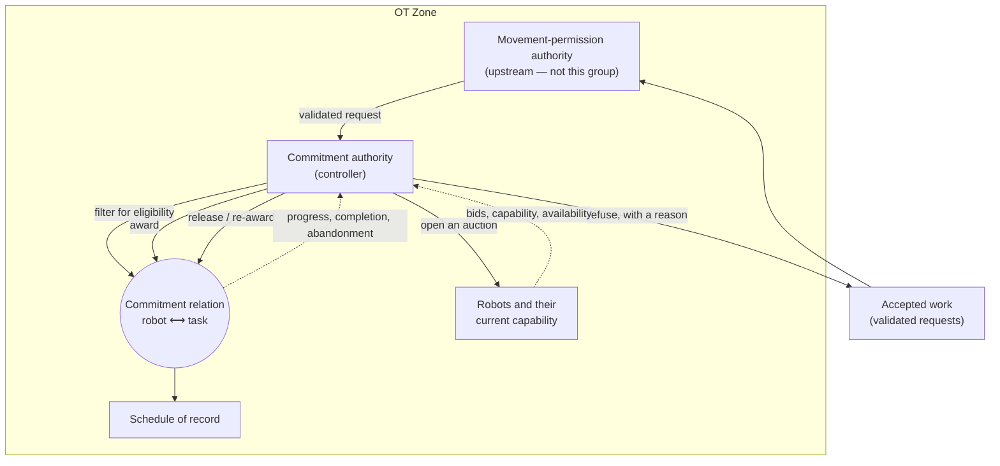

# control — Invariants

Contract invariants for the `control` group (the `rmf_task` dispatcher; `control.deconflict` joins
this catalog when it is manifested). Hazard invariants live in the superproject
(`requirements/invariants.md`); rows here trace up to them. Verification of these rows lives in
[`../verification/control.md`](../verification/control.md).

Taxonomy, admission gate, and ID grammar: [`README.md`](README.md).

**Discovery:** inline · 2026-09-21

> **Provenance of this page.** Discovered **inline**, per the `discovering-invariants` dispatch rule:
> no oblysk design existed to be biased by — this is the first page in `rmf_oblysk`'s overlay design
> tree. The upstream Open-RMF sources in this fork were **not** read during the sweep; they are an
> implementation of the thing being constrained, and reading them is the contamination the skill
> exists to prevent.
>
> **The sweep ran from** `requirements/05-control-plane.md` (CTL-6, CTL-15, and the surrounding CTL
> family), the superproject hazard catalog, and `design/pages/00-component-catalog.md`'s G4 table.
>
> **Two catalogs were read before writing, not after, and both cost a candidate.** This is the
> correction Cycle B's first seam learned the hard way: the catalog that already parents to your own
> hazards is the first one to read. `requirements/invariants.md`'s refinement column gives HAZ-1 → `INV-FP-1` (line 90), HAZ-15 → `INV-FP-14` (line 104), HAZ-35 → `INV-IR-7` (line 124). Reading them rejected two rows on clause 5 before either
> was drafted — see §5 — and the second rejection is the more interesting one, because `INV-FP-14`
> places its obligation *on this component* while being owned by another.
>
> **HAZ-35 is this group's home hazard, and it is nearly unrefined.** Its only prior refinement is
> `INV-IR-7`, which is about the structure of an emitted IR at the producer's boundary. Everything
> HAZ-35 says about an artifact *accepted for execution* — that it starts, or is refused with a
> stated reason, within a bound — has no row anywhere. Four of this catalog's five rows sit there.
>
> **Contamination, declared.** `design/pages/00-component-catalog.md:87` ratifies the
> `ValidatedTaskRequest` (`oblysk_envelope`) contract, and CTL-6 and CTL-15 both name mechanism in
> their own text — "bid/award auction", "filter-before-cost", "typed tag grammar". Rows below are
> phrased over **commitment**, never over the auction that produces it; §6's mechanism swap is the
> check, and it moved nothing.
>
> **Tiers** are assigned against the taxonomy recorded in
> [`../verification/control.md §1`](../verification/control.md#1-control-harness) — T0 formal model;
> T1 deterministic sim; T2 real OS/host execution with real faults *and* real timing; T3 property /
> decision-table.

---

## 1. Control structure

STPA step 1. This is the **plant** — a floor of robots, a stream of accepted work, and the
commitment relation between them — not the software decomposition.

**The controlled process is the commitment relation, not the auction.** What this group controls is
*which robot is committed to which task, and whether that commitment can be honoured*. Read as a
scheduler it becomes a component about throughput and fairness, and carries no invariants at all —
which is how dispatchers come to be designed as queues. Every row below is a way a commitment can be
made that the floor cannot honour, or an accepted artifact can come to sit in neither of its two
legitimate end states.

| Element | Kind | Responsibility | Trust boundary |
|---|---|---|---|
| Commitment authority | controller | The only role that may bind a robot to a task, release that binding, or refuse work | OT |
| Commitment relation | controlled process | Which robot is committed to which task, and the state of each commitment | OT |
| Robots and their capability | controlled process | What each robot can currently do; the input eligibility is decided against | OT |
| Schedule of record | controlled process | Where honoured commitments become reservations. **Not this group's to write safely** — HAZ-19 is `ha`'s | OT |
| Movement-permission authority | sensor/feedback | Upstream gate. This group consumes its verdict and asserts nothing about it | OT |
| Bids, capability, availability | sensor/feedback | What the fleet reports about itself | OT |

### Control actions

Every row here gets a full four-class UCA sweep in §2.

| # | Action | Issued by | Acts on | Authority required |
|---|---|---|---|---|
| CA1 | accept a request for dispatch | commitment authority | the accepted set | a verdict from the permission authority (upstream) |
| CA2 | open an auction | commitment authority | the fleet | none — soliciting binds nothing |
| CA3 | filter bidders for eligibility | commitment authority | the bid set | none — a determination, not a permission |
| CA4 | award a request to a bidder | commitment authority | the commitment relation | the request must be accepted and the bidder eligible |
| CA5 | release or re-award a commitment | commitment authority | the commitment relation | an existing commitment, explicitly released first |
| CA6 | refuse a request, with a reason | commitment authority | the caller | none — always permitted |

### Process-model assumptions

Where the timing and ordering hazards actually live.

| Controller | Believes | Stale when |
|---|---|---|
| Commitment authority | a bidder's capability set is what it reported | the robot's state changed after it bid — a battery threshold, a failed sensor, an operator withdrawal — `INV-RMF-4` |
| Commitment authority | an award it issued was received and is live | the award raced a bid timeout, and the authority now believes something the bidder does not — **the interleaving `INV-RMF-3` is written against** |
| Commitment authority | a request it accepted is still wanted | the caller withdrew or the request's verdict lapsed; neither is observable from the accepted set alone |
| Commitment authority | an unresponsive bidder is unavailable | it is executing and merely silent, which is indistinguishable without an explicit release protocol |

## 2. Unsafe control actions

Every control action from §1 × the four canonical classes. A cell is either a `HAZ-` ID or
**considered-and-clear** with a reason — never blank.

| Control action | Not provided | Provided unsafely | Wrong timing / order | Stopped too soon / applied too long |
|---|---|---|---|---|
| **CA1** accept a request | **HAZ-35** — a validated request is never taken up: it sits in neither of its two legitimate end states, started or refused, and nothing reports that it is stuck | considered-and-clear: accepting something that never traversed the gate is `INV-FP-1`'s subject (`edge_oblysk`), which quantifies over *every* movement request enacted at the dispatch boundary and requires exactly one prior PASS verdict from an admitted authority. Duplicating it here is rejected in §5 on clause 5 | considered-and-clear **on a narrower ground than the first draft claimed**: this group does not re-decide a verdict it was handed, and no row here quantifies over verdict age. The first draft attributed the obligation to `INV-HA-8` and `INV-FP-1`; neither holds it — see [§7](#7-open-gaps-and-escalations), which records the gap rather than waving it off | **HAZ-35** — accepted indefinitely under sustained overload rather than refused, so the accepted set grows and every artifact in it is in neither end state |
| **CA2** open an auction | **HAZ-35** — accepted and never offered to anyone; the artifact is held with nothing acting on it | considered-and-clear: soliciting broadly is harmless because binding happens at CA4 and eligibility at CA3. A bid from an incapable robot costs a round trip and no commitment | **HAZ-35** — opened before the fleet's state is readable, so the bid set reflects a floor that no longer exists and every award from it is unhonourable | **HAZ-35** — held open without bound, waiting for a quorum of bids that never arrives |
| **CA3** filter for eligibility | **HAZ-35** — no hard filter at all: every bidder is eligible and the award goes to whoever is cheapest, including a robot that cannot perform the task | **HAZ-35** — filtering by *cost* rather than by hard capability, so a partially-capable bidder is penalised and still winnable. This is the exact design CTL-15 names, and the reason "never mis-route" is only testable if eligibility is a filter | **HAZ-35** — filtered against a capability set read before a change the robot has since reported, so an eligible-at-read bidder is ineligible at award | considered-and-clear: an over-strict filter refuses work, which is CA6's subject and the safe direction — a refusal is a legitimate end state and a mis-award is not |
| **CA4** award | **HAZ-35** — bids received, evaluated, and no award issued; the request stays in the accepted set with the auction closed | **HAZ-35** — awarded to a bidder the filter should have excluded, so the commitment cannot be honoured and nothing yet says so | **HAZ-15** — awarded while a prior award for the same request is still live, so one intent yields two commitments and, if both are honoured, two motion allocations | **HAZ-35** — an award left outstanding with no progress and never released, which holds the robot and strands the task at once |
| **CA5** release or re-award | **HAZ-35** — a commitment that cannot be honoured is never released, so the robot stays held and the task stays uncompleted indefinitely | **HAZ-15** — re-awarded without the first commitment being explicitly released, which is the same two-commitments state CA4's wrong-timing cell reaches by a different route | **HAZ-15** — released after the committed robot has already begun executing, so a second award can be issued while the first is physically in progress | considered-and-clear: deferring a release holds a robot idle. That is an availability cost in the safe direction and is bounded by CA5's not-provided cell |
| **CA6** refuse, with a reason | **HAZ-35** — neither started nor refused, which is HAZ-35's predicate stated directly; the artifact is accepted and then silent | **HAZ-35** — refused with no reason, or with a reason the caller cannot act on: indistinguishable from a silent drop at the boundary where it matters | **HAZ-35** — refused after the declared bound has already elapsed, so the bound was not met even though the outcome eventually arrived | considered-and-clear: a standing refusal is a stated end state. Repeating it costs nothing and asserts nothing false |

Twenty-four cells, **six** `considered-and-clear`, eighteen naming a hazard. The distribution is the
finding: **HAZ-35 carries fifteen of the eighteen**, because almost every way of getting dispatch
wrong ends with an accepted artifact in neither of its two legitimate end states. That concentration
is why four of this group's five rows parent to it, and it is unusual — most groups in the repo set
spread across three or four hazards.

Note also what is **not** here. No cell names HAZ-1, though CA1's provided-unsafely cell is about
exactly the gate HAZ-1 governs: `INV-FP-1` owns that claim and owns it from the same boundary, so
naming the hazard here would assert an obligation this group does not carry.

## 3. Admitted invariants

### INV-RMF-1 — Eligibility is a filter, never a cost term

| Clause | |
|---|---|
| **Predicate** | For every award, the awarded bidder satisfies every capability the request declares as required. Eligibility is a total function of (the request's required capabilities, the bidder's reported capability set) alone: no cost, score, priority, load, or bid ordering can make an unqualified bidder awardable, and no qualified bidder is excluded by the same quantities. |
| **Provenance** | contract ← HAZ-35 (realizes CTL-15, CTL-6) |
| **Violation** | At the award boundary: an award whose bidder lacks a required capability; or, injected, a qualified and an unqualified bidder where raising **the qualified bidder's** cost past any finite amount changes which is awarded. |
| **Forbids** | Modelling a missing capability as a large cost penalty — the natural implementation in any bidding system, and the one CTL-15 names, because it makes "never mis-route" untestable: under enough load every penalty is payable. Treating capability tags as advisory metadata the allocator may override. Any design where the eligible set is computed *after* ranking, so an empty eligible set silently falls back to the cheapest bid. |
| **Minimal** | Not implied by `INV-RMF-2`: a dispatcher that always reaches an end state can reach it by awarding to an incapable robot and discovering the failure later, which satisfies that row's bound and violates this one. Not implied by `INV-FP-1` (`edge_oblysk`): that row requires a permission to exist before the dispatch boundary and says nothing about *which* robot the request is then committed to — the verdict validates the task, not the assignment. |
| **Scope** | group |
| **Tier** | **T3** — a property of a single determination, decidable by a decision table over (required tags × reported tags) with no running system. The perturbation oracle is also T3 — two evaluations of a pure function — but **its direction is load-bearing**: sweeping the *unqualified* bidder's cost cannot discriminate, because under a penalty design its effective score is `base + P` and a large `P` keeps the outcome flat across the whole sweep. The row's own Forbids clause says where the failure actually arrives — *under enough load every penalty is payable* — so the oracle must raise **the qualified bidder's** cost past `P`, or observe the eligible set directly before ranking. A sweep in the other direction passes on exactly the design this row exists to exclude. |
| **Interleaving** | *(not a T0 row)* |
| **Established by** | [`dispatch.md §6.2`](../control/dispatch.md#62-eligibility-and-the-freshness-it-is-decided-against-inv-rmf-1-inv-rmf-4) |

### INV-RMF-2 — Every accepted request reaches a startable state or a stated refusal, within a bound

| Clause | |
|---|---|
| **Predicate** | For every request the dispatcher accepts, within a declared bound it either reaches a state in which some step of it can start, or it is refused. No accepted request is in neither state after the bound, under any fleet condition including no eligible bidder, no bids at all, and sustained overload. |
| **Provenance** | contract ← HAZ-35 (realizes CTL-15, CTL-6) |
| **Violation** | An accepted request observed after the bound with no start and no refusal; an overload trace in which the accepted set grows without bound. |
| **Forbids** | Accepting work whenever it arrives and letting the queue absorb the excess — the default behaviour of every queue, and the reason HAZ-35 exists: backpressure that is expressed as unbounded acceptance converts an overload into a silent stall. An auction that closes with no bids and simply retries, with no terminal refusal. Any design where "no eligible bidder" is a transient condition retried forever rather than a refusable outcome. |
| **Minimal** | Not implied by `INV-RMF-1`: a perfectly filtered dispatcher with no eligible bidder must still reach an end state, and filtering says nothing about doing so. Not implied by `INV-RMF-5`, which constrains what a refusal *says* once issued and not that one is issued at all. Not implied by `INV-IR-7`, HAZ-35's only prior refinement: that row constrains an IR's internal structure at the producer's emit boundary, upstream of acceptance, and a structurally perfect IR can still be accepted and stranded. |
| **Scope** | group |
| **Tier** | **T1** — a bounded-progress property under injected fleet conditions (no bidders, no eligible bidders, sustained overload), shown by deterministic simulation. The bound's *value* is a real-timing question for the design page; that an end state is reached is not. |
| **Interleaving** | *(not a T0 row)* |
| **Established by** | [`dispatch.md §6.1`](../control/dispatch.md#61-acceptance-and-capacity-refusal-inv-rmf-2-entry-half) |

### INV-RMF-3 — At most one live commitment per request, and a re-award requires an explicit release

| Clause | |
|---|---|
| **Predicate** | At every instant, each accepted request has at most one live commitment. A second commitment for the same request is reachable only through a state in which the first has been explicitly released, and the release is agreed by the committed robot rather than assumed by the dispatcher from silence. |
| **Provenance** | contract ← HAZ-15 (realizes CTL-15, CTL-6) |
| **Violation** | Two live commitments for one request, observed in the commitment relation; or a release recorded by the dispatcher with the previously committed robot still executing. |
| **Forbids** | Inferring release from an unresponsive bidder — the single most attractive design here, because a silent robot and an unavailable robot are indistinguishable without an explicit protocol, and re-awarding on silence keeps throughput up. Re-awarding on a bid or award timeout while the original award may still be in flight. Treating the commitment as dispatcher-local state that the robot's view is expected to follow. |
| **Minimal** | Not implied by `INV-FP-14` (`edge_oblysk`), on two independent grounds. **(1) Two live commitments need not produce two enacted motions.** If `B` is awarded while `A`'s award is in flight and `A` completes first, `INV-FP-14` — *at most one motion allocation is enacted* — is satisfied, while this row is violated for the whole interval both commitments were live. Non-implication is strict, and this is the ground that survives an adversarial reading of `INV-FP-14`'s unqualified first sentence. **(2) `INV-FP-14` says nothing about release.** This row's second half — that a release is *agreed by the committed robot* and never inferred from silence — has no counterpart anywhere in the repo set. A weaker third ground, true but not load-bearing: that row's subject is duplicate *delivery* absorbed at the receiving boundary, while this row's is the dispatcher's own decision, arriving through no delivery at all. |
| **Scope** | group |
| **Tier** | **T0** — the failure is a concurrent interleaving of an award in flight and a timeout-driven release, and no deterministic simulation explores the schedule that exhibits it. The obligation is `formal/single-live-commitment/`, **not yet discharged**, and no capability level below L3 claims this row. |
| **Interleaving** | 1. The dispatcher awards request `r` to robot `A` and starts its award-acknowledgement timer. 2. The award message is delayed in flight; `A` has not yet received it. 3. The timer expires. The dispatcher observes no acknowledgement and concludes `A` is unavailable. 4. The dispatcher marks `r` uncommitted and awards it to robot `B`. 5. The original award arrives at `A`, which accepts it and begins executing. Both `A` and `B` now hold a live commitment for `r` — the moment the invariant breaks, and neither party has done anything locally wrong. |
| **Established by** | [`dispatch.md §6.3`](../control/dispatch.md#63-award-release-and-the-one-thing-silence-may-not-mean-inv-rmf-3) |

### INV-RMF-4 — Eligibility is decided against a capability set no older than a declared bound

| Clause | |
|---|---|
| **Predicate** | Every award's eligibility determination is made against a bidder capability observation whose age, at the moment of award, does not exceed a declared bound. An observation older than the bound is not usable for eligibility; it is refreshed or the bidder is excluded. |
| **Provenance** | contract ← HAZ-35 (realizes CTL-15) |
| **Violation** | An award whose eligibility was decided against an observation older than the bound at award time; a trace in which a robot reports a capability loss and is awarded work requiring that capability afterwards. |
| **Forbids** | Caching the fleet's capability set for the duration of an auction and awarding against the cache — attractive because it makes the auction a pure function of one snapshot, which is exactly what `INV-RMF-1` asks for and this row is what stops that being bought with staleness. Treating a bid as an assertion of present capability with no age attached. Any design where a robot's withdrawal is processed only between auctions. |
| **Minimal** | Not implied by `INV-RMF-1`: that row makes eligibility a pure function of *the inputs it is given*, and is silent on whether those inputs describe the floor as it is now. The two are precisely complementary, and a design can satisfy either alone — a perfectly pure filter over a stale snapshot, or a fresh snapshot ranked by cost. |
| **Scope** | group |
| **Tier** | **T1** — an injected-staleness property: report a capability loss at a controlled point in the auction and require the award to reflect it or exclude the bidder. Deterministic simulation suffices; the bound's value is the design page's. |
| **Interleaving** | *(not a T0 row)* |
| **Established by** | [`dispatch.md §6.2`](../control/dispatch.md#62-eligibility-and-the-freshness-it-is-decided-against-inv-rmf-1-inv-rmf-4) |

### INV-RMF-5 — A refusal names a reason from a declared, enumerable set

| Clause | |
|---|---|
| **Predicate** | Every refusal carries a reason drawn from a set declared in advance and enumerable by the caller, sufficient to distinguish at minimum: no eligible bidder, no bids within the bound, the request itself inadmissible, and capacity refused. No refusal carries a reason outside the declared set. |
| **Provenance** | contract ← HAZ-35 (realizes CTL-15, CTL-6) |
| **Violation** | A refusal whose reason is absent, free-text, or outside the declared set; two operationally different refusals a caller cannot tell apart. |
| **Forbids** | A single generic failure reason — the default, and the one that makes a refusal indistinguishable from a drop at the boundary where a caller must decide whether to retry, re-plan, or escalate. Free-text reasons, which are enumerable only by reading the implementation. Reporting "no eligible bidder" and "no bids" as the same outcome, though the first is a standing property of the fleet and the second is transient. |
| **Minimal** | Not implied by `INV-RMF-2`: that row requires a refusal to be *issued* within a bound and is indifferent to its content. A dispatcher refusing everything within the bound, with one opaque reason, satisfies it entirely and leaves the caller unable to act — HAZ-35 says "refused **with a stated reason**", and this row is the half of that phrase `INV-RMF-2` does not carry. |
| **Scope** | group |
| **Tier** | **T3** — a property of the refusal interface's declared surface, decidable by enumerating the reason set against the distinguishable outcomes, with no running system. |
| **Interleaving** | *(not a T0 row)* |
| **Established by** | [`dispatch.md §6.4`](../control/dispatch.md#64-progress-to-an-end-state-and-what-a-refusal-says-inv-rmf-2-inv-rmf-5) |

## 4. Shape sweep

Completeness pass. Every shape answered with a candidate or an explicit N/A + reason.

| Shape | Candidate | Note |
|---|---|---|
| uniqueness / at-most-one | `INV-RMF-3` | One live commitment per request. The group's only T0 row, and the only one with an interleaving. |
| authority / fencing | N/A | The authority to dispatch at all is upstream — `INV-FP-1` requires a prior verdict, and the command *regime* is `ha`'s (HAZ-14's eleven rows). `INV-RMF-3`'s explicit release is adjacent to fencing but is an agreement protocol, not an epoch. Recorded so a later cycle adding a dispatcher epoch notices it is taking a new cross-group tie. |
| ordering / monotonicity | N/A | Deliberate. An auction has no order obligation the floor can observe: two requests awarded in either order produce the same commitments. Nothing here rests on order, which is why this group survives an adversary holding message-reordering power — except at `INV-RMF-3`, where the hazard is concurrency rather than order. |
| conservation | `INV-RMF-2` | Nothing accepted is lost: every accepted request leaves the accepted set through one of two declared exits. |
| determinism / purity | `INV-RMF-1` | Eligibility is a total function of declared inputs. Note this is *not* HAZ-33: that row is refined by `INV-ING-17`/`INV-ING-28` over evidence protection and floor-state assertion, and realizes PHY-3/PHY-4. Purity is admitted here under HAZ-35 because its failure mode is an unhonourable commitment, not an irreproducible determination. |
| freshness bound | `INV-RMF-4` | The capability observation's age at award. Complements `INV-RMF-1` exactly. |
| idempotence | N/A | Absorbing a duplicate delivery of the same request is `INV-FP-14`'s, at the receiving boundary — which is this component, so the obligation lands here while the row lives there. Recorded as a cross-group tie in [`README.md §5`](README.md#5-cross-group-ties) rather than duplicated. |
| liveness / progress | `INV-RMF-2` | Bounded progress to an end state under every fleet condition. |

### 4.1 Deferred to the design cycle

Two rows quantify over a bound whose **value** is not declared anywhere yet. `INV-RMF-2`'s is the
time within which an accepted request must start or be refused; `INV-RMF-4`'s is the maximum age of
a capability observation usable for eligibility. Both are design-page questions and `§11` of
[`../control/dispatch.md`](../control/dispatch.md) is deferred in the reduced page.

The consequence is concrete and is recorded so it is not discovered at harness time: **F9 is not
injectable as written** until `INV-RMF-4`'s bound has a value, because "an observation older than
the bound" has no referent. The rows are admissible regardless — a predicate over a declared
constant is still a predicate — but the constant is owed.

## 5. Rejection log

Candidates that failed the gate. Keeps the next cycle from re-litigating, and shows whether the gate
has teeth.

| Candidate | Clause failed | Reasoning |
|---|---|---|
| The dispatcher acts only on a request that traversed the movement-permission gate, the RMF-API submission path included | **5 (Minimal)** | `INV-FP-1` (`edge_oblysk`) quantifies over *every movement request enacted at the dispatch boundary* and requires exactly one prior PASS verdict from an admitted authority instance. A self-minted verdict on the API path fails it; a direct injection into `rmf_task` fails it. The row is CTL-6's single-gate obligation seen from the other side of the same boundary, and the boundary already has an owner. Rejected **before drafting**, by reading HAZ-1's refinement first. |
| A retry or replay of an already-dispatched request produces no second commitment | **5 (Minimal)** | `INV-FP-14`'s predicate already places absorption **at the receiving boundary**, which is this component. The obligation lands here; the row does not. What survived as `INV-RMF-3` is the strictly different case — the dispatcher committing twice on *its own* initiative after a timeout, with no redelivery involved. Worth recording that the two were nearly merged. |
| Award latency and queue depth are bounded and alerted | **4 (Forbids)**, **5 (Minimal)** | The bound is `INV-RMF-2`'s. What remains is alerting, which excludes only "a design with no alerting" — an operability requirement rather than a constraint on the commitment relation. An unobservable bound is part of `INV-RMF-2`'s Violation clause, not a row. |
| Bidding is a sealed-bid auction with a declared close | **1 (Predicate)**, **2 (Provenance)** | Mechanism. It is *how* `INV-RMF-2`'s bound and `INV-RMF-1`'s filter are realised; §6's swap confirms neither row moves when the auction is replaced by a static assignment table. Belongs in the design page's §6 naming the rows it discharges. |
| The schedule of record is never mutated by more than one writer | **5 (Minimal)** | HAZ-19, owned by `INV-HA-18`, `INV-HA-20` and `INV-HA-21`. The dispatcher writes commitments that *become* reservations, but single-writer discipline over the schedule is the HA group's and is a different subject from whether a commitment should have been made. |

## 6. Mechanism-swap self-check

2026-09-21 — swapped the **`rmf_task` bid/award auction** for a **static assignment table**: a
precomputed robot-per-task-class map, consulted rather than bid on, with no auction, no bids, no
timeouts and no close.

Rows that changed: **none**.

- `INV-RMF-1` holds — a static table that assigns an incapable robot violates it exactly as an
  auction that cost-penalises one does. The row never mentions a bid.
- `INV-RMF-2` holds — a table lookup that finds no capable robot must still refuse within the bound;
  the swap removes the "no bids" condition and leaves "no eligible bidder" untouched.
- `INV-RMF-3` holds, and **the swap sharpens why it is T0**: with no auction there is no bid timeout,
  yet the interleaving survives — the dispatcher still awards, still waits for acknowledgement, and
  still has to decide what silence means. The hazard is the acknowledgement race, not the auction.
- `INV-RMF-4` holds — a static table is the *most* exposed design to a stale capability set, since
  its inputs are precomputed by construction.
- `INV-RMF-5` holds — refusal reasons are a property of the refusal interface, and the swap changes
  which reasons occur, not which are declarable.

The negative result is worth as much as the positive one: the three rejected mechanism candidates in
§5 would all have moved under this swap — a sealed-bid close, an award-latency bound expressed in
auction rounds, and a queue-depth alert on a queue that no longer exists.

## 7. Open gaps and escalations

**A lapsed verdict between issuance and acceptance is owned by no row in the repo set.**

`INV-FP-1` requires exactly one PASS verdict issued *strictly before* a request crosses the dispatch
boundary, by an authority admitted *at the moment the verdict was used*. It bounds the authority's
currency, not the verdict's own age. `INV-HA-8` bounds a command's age from **issue to actuation**,
at the egress guard — so a command issued freshly by an adapter acting on a ten-minute-old verdict
satisfies it. Between the two lies an interval nothing constrains: verdict issued at `T`, accepted
for dispatch at `T + Δ`, with no row bounding `Δ`.

**Why no row was admitted here for it.** This group does not re-decide a verdict it was handed, and
a row obliging the dispatcher to age-check one would put the judgement in the wrong place — the
same division `INV-CDT-8` draws for the conduit, where the carrier delivers validity and the
consumer judges it. The question is whether the *permission authority* should stamp a validity
window on its verdict, which is `fast-path`'s to answer and `requirements`' to require.

Recorded here because §2's CA1 wrong-timing cell is cleared on this reasoning, and a cleared cell
whose reason is "someone else owns it" must name someone who does — or say plainly, as this one
now does, that nobody yet has.
